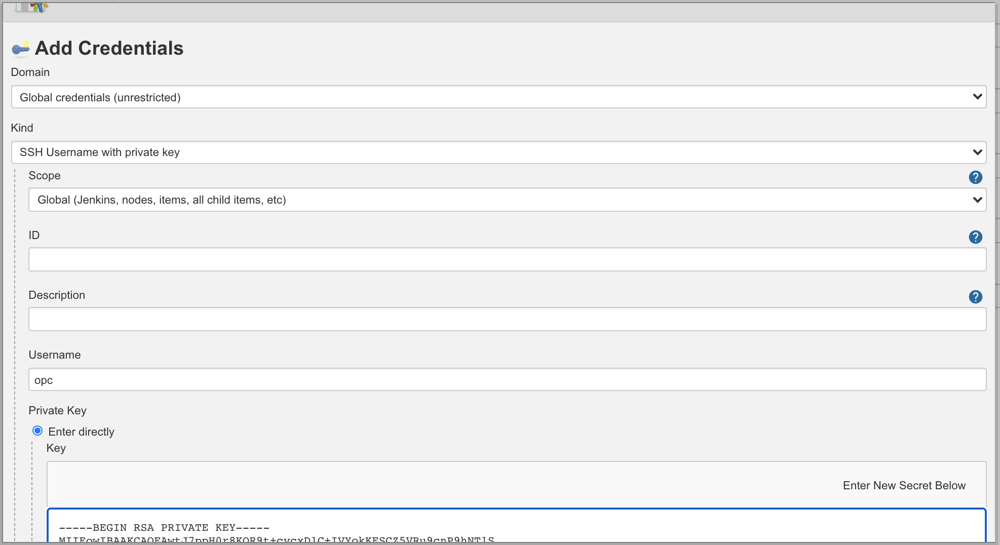

# Jenkins on OCI

**Goal**: Use Oracle Cloud Infrastructure VMs to run Jenkins. 

**Assumptions**: Oracle Cloud Infrastructure with a compute node to act as the master jenkins node. Node should have internet access and ssh ability. 

## Initializing Jenkins

**Documentation**: https://blogs.oracle.com/cloud-infrastructure/deploy-jenkins-on-oracle-cloud-infrastructure

1. OCI Set-up: Create a VCN with a single subnet and internet connectivity to house Jenkins master and agent nodes. Launch a compute instance to be the Jenkins master. Open TCP port 8080 on the security list for the instance's subnet by adding the following ingress rule.

    


2. Jenkins Installation: Connect to the compute instance and install Jenkins using the below script. This script (1) adds the Jenkins Repository to your instance, (2) installs Jenkins and Java, (3) starts the Jenkins Service, and (4) opens Ports 80 and 8080 in the OS firewall.

    ```
    sudo yum -y update
    sudo wget -O /etc/yum.repos.d/jenkins.repo http://pkg.jenkins.io/redhat-stable/jenkins.repo
    sudo rpm --import http://pkg.jenkins.io/redhat-stable/jenkins.io.key
    ​
    sudo yum -y install java-1.8.0-openjdk-devel
    sudo yum -y install jenkins
    ​
    sudo systemctl daemon-reload
    sudo systemctl start jenkins
    sudo systemctl status jenkins
    ​
    # To enable the firewall
    YOURPORT=8080
    PERM="--permanent"
    SERV="$PERM --service=jenkins"
    sudo firewall-cmd $PERM --new-service=jenkins
    sudo firewall-cmd $SERV --set-short="Jenkins ports"
    sudo firewall-cmd $SERV --set-description="Jenkins port exceptions"
    sudo firewall-cmd $SERV --add-port=$YOURPORT/tcp
    sudo firewall-cmd $PERM --add-service=jenkins
    sudo firewall-cmd --zone=public --add-service=http --permanent
    sudo firewall-cmd --reload
    ​
    # You will find your temp admin password in either of these locations
    # /var/lib/jenkins/secrets/initialAdminPassword
    # /var/jenkins_home/secrets/initialAdminPassword
    ​
    # Your app is running in 8080
    ```

    The `sudo systemctl status jenkins` should have the below output if Jenkins is installed succcessfully. 
            
    

    
    For the purposes of this walk-through, we're running our project from our master node when we test it. For that reason, we need git and terraform on the master node as well (the project in the final section). 

    ```
    sudo yum -y install git terraform
    ```


3. Access Jenkins: On your web browser, access Jenkins at **http://<jenkins_master_node_public_IP>:8080**. You will see the "Unlock Jenkins" screen which requires the initial admin password. Run `sudo cat /var/lib/jenkins/secrets/initialAdminPassword` in your instance to view the password and then copy and paste into the Administrator password field.

    


4. Finish Set-up: Select **Install suggested plugins**. Then, continue through options until you reach **Start using Jenkins**.

    


## Connecting to OCI

1. Install OCI Plugin: From the left-hand side menu, navigate to **Manage Jenkins** then select **Manage Plugins**. Under the Available tab, search for the "Oracle Cloud Infrastructure Compute" plugin and then select **Install without restart**.

    


2. Configure OCI Cloud: Go back to the **Manage Jenkins** page then select **Manage Nodes and Clouds**. From the left-hand side menu, click on **Configure Clouds**. Then click OCI Compute. Drop down the **Add a new cloud** menu and select **Oracle Cloud Infrastructure Compute**. 

    

    Enter a Name and then select the **Add** button under Credentials. The Jenkins Credential Provider should open. Select the "Kind" of credential to be "Oracle Cloud Infrastructure Credentials" then populate the fields with your API fingerprint, API Key, User OCID, and Tenancy OCID. Select **Verify Credentials** to test your connection to Oracle Cloud. You should recieve the message "Successfully connected to Oracle Cloud Infrastructure Compute".

    


3. Create Instance Template: Scroll down and click on **Add a new instance template**. Specify a label such as "oci-butler" to later assign projects. Then, fill in values for the compute instance shape and subnet (be sure to select the Compartment and Availability Domain where your subnet is located). 

    


    Create an SSH credential for the agent nodes using the Jenkins Credential Store. Select the "Kind" of credential to be "SSH Username with private key." 

    


4. Initialize Agents: Click the Advanced button. Keep the defaults but configure the init script for the nodes. In this lab, we are using git and terraform in our sample project so we will initialize our agent nodes to have both programs. Additionally, agent nodes also require having Java installed on them before communicating with the master so we install java as well in the below script.

    ```
    sudo yum -y install update
    sudo yum -y install java git terraform
    ```

    

5. Test Cloud Configuration: Navigate to **Manage Jenkins** then select **Manage Nodes and Clouds**. From the Nodes dashboard, drop down the "Provision via Oracle Cloud Infrastrcuture Compute" list and select your instance template. Enter in the number of nodes to create then click on **Create Node(s)**. After a few minutes, you should see an agent in the dashboard. This agent will also be accessible from OCI. 

    


## Creating a Project

This sample project shows how to use Jenkins with a basic Terraform project and a github repository. This section assumes you have cloned this github repository to your own account and filled in the vars.tf file with your own values. 

1. Connect Github to Terraform: From your github repository, go to **Settings**, **Webhooks**, then select **Add Webhook**. Under Payload URL, enter in `<your-jenkins-url>/github-webhook/`

    

2. Add Credentials: First, we'll add our API Key for our Terraform provider. Click on **Manage Jenkins** and then **Manage Credentials**. Under the **Store** column select **Jenkins**. Select **Global credentials (unrestricted)**. 

    

    Click **Add Credential** from the left-hand side panel.  Select the "Kind" of credential to be "Secret File" then upload the API key you use to authenticate with your terraform provider. Give the api key credential an id string to be used in the pipeline script.

    

    Next, we'll add in out github login. Again, click **Add Credential** from the left-hand side panel.  Select the "Kind" of credential to be "Username/Password" then enter your github login information. Give the github credential an id string to be used in the pipeline script.

    


3. Create Pipeline: From the main Dashboard, select **New Item** from the left-hand panel and then select **Pipeline** as the type of project.

    

    Under "Build Trigger", check **GitHub hook trigger for GITScm polling**. That will trigger the build to run everytime a push is made to the github repository. Finally, under "Pipeline script" enter the following code. Be sure to enter in the correct credentials id string for the terraform api key and the github login.

    ```
    pipeline {
        agent any
        environment {
            TF_VAR_api_private_key_path = credentials('terraform_key_id')
        }
        stages {
            stage('Terraform Init') {
                steps {
                    git credentialsId: 'github_cred_id', url: 'https://github.com/tanvi-orcl/Jenkins-TF.git'
                    sh "terraform init"
                }
            }
            
            stage('Terrraform Plan') {
                steps {
                    sh "terraform plan"
                }
            }
        }
    }
    ```

    


4. Trigger Build: From the left-hand side menu of the pipeline, select **Build Now**. Under "Build History" you should see the build number. If the circle next to it is blue, the pipeline ran successfully.

    

    If you select the build from "Build History" and look at the **Console Output** from the left-hand side panel, you should see the full Terraform plan for your code. If you'd like to see if the github integration is working, push code to the github repositiory. This action should trigger a build. 

    

5. Use Agent Nodes: If not already spun-up, create an agent node using the process earlier. Go to your pipeline and from the left-hand side panel, select **Configure**. Change the `agent any` line in the script to `agent { label 'oci-butler' }` where oci-butler is the label created in the instance template.

    

    If you look at the console log, you'll see it's using the agent node instead of the master node. 

    